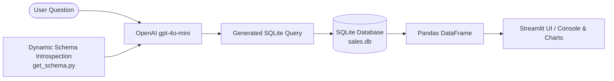

# 📊 Sales Data Assistant (Text-to-SQL AI)

An AI-powered Text-to-SQL application that translates natural language questions into executable SQLite queries using OpenAI's LLMs. Explore, analyze, and visualize a realistic 10,000+ record e-commerce sales database through an interactive **Streamlit Web App** or a **Command-Line Interface (CLI)**.

---

## 🌟 Key Features

- **🗣️ Natural Language to SQL**: Ask questions in plain English (e.g., *"Which region generated the highest revenue?"*) and get optimized SQLite queries executed instantly.
- **🔍 Dynamic Schema Introspection**: Live database inspection (`sqlite_master` & `PRAGMA`) dynamically builds LLM context without any hardcoded column names or schemas.
- **📊 Interactive Streamlit Dashboard**:
  - **Sidebar Overview**: Live row-count metrics (`Customers`, `Products`, `Sales`) and collapsible database schema viewer.
  - **1-Click Examples**: Pre-built example query buttons for quick exploration.
  - **Smart Visualizations**: Auto-renders interactive bar charts when numerical aggregations are detected.
  - **Session Query History**: Keeps a chronological record of all questions and generated SQL queries.
- **💻 Interactive CLI**: Continuous terminal loop support with `STOP`/`EXIT` controls.
- **🎲 Realistic Synthetic Dataset**:
  - 500 Customers with unique emails across 4 regions.
  - 50 Products categorized into *Electronics*, *Apparel*, *Home*, *Sports*, and *Books*.
  - 10,000 Sales transactions featuring realistic **80/20 Pareto distribution** and **Nov-Dec seasonal holiday bumps**.
  - 100% relational integrity with strict foreign key constraints.

---

## 🏗️ Architecture & Workflow



---

## 📁 Project Structure

```text
Day1_Datagpt/
├── Database/
│   ├── create_schema.py   # DDL script initializing customers, products, sales tables
│   ├── seed_data.py       # Faker-powered data generator (500 customers, 50 products, 10k sales)
│   ├── verify_db.py       # Health check, FK integrity validator & sample query runner
│   ├── test_data.py       # Analytical sample queries and reporting script
│   └── sales.db           # SQLite database file (generated)
├── .env.example           # Template for environment variables
├── .gitignore             # Git ignore configuration (protects .env and cache)
├── app.py                 # Streamlit Web Application
├── get_schema.py          # Dynamic schema extractor for LLM prompting
├── main.py                # Core text-to-SQL logic & interactive CLI runner
├── requirements.txt       # Python package dependencies
└── README.md              # Project documentation
```

---

## 🚀 Getting Started

### 1. Prerequisites
- Python 3.10 or higher
- An OpenAI API Key ([Get one here](https://platform.openai.com/api-keys))

### 2. Clone the Repository
```bash
git clone https://github.com/your-username/sales-data-assistant.git
cd sales-data-assistant
```

### 3. Create & Activate Virtual Environment
- **Windows (PowerShell):**
  ```powershell
  python -m venv venv
  .\venv\Scripts\Activate.ps1
  ```
- **macOS / Linux:**
  ```bash
  python3 -m venv venv
  source venv/bin/activate
  ```

### 4. Install Dependencies
```bash
pip install -r requirements.txt
```

### 5. Configure Environment Variables
Create a `.env` file in the root directory by copying `.env.example`:
```bash
cp .env.example .env
```
Open `.env` and add your OpenAI API key:
```env
OPENAI_API_KEY=your_actual_openai_api_key_here
```

---

## 🗄️ Database Setup (One-time)

If `sales.db` is not present or you want to generate fresh data:

1. **Initialize the Schema**:
   ```bash
   python Database/create_schema.py
   ```
2. **Seed 10,000+ Records**:
   ```bash
   python Database/seed_data.py
   ```
3. **Verify Database Integrity**:
   ```bash
   python Database/verify_db.py
   ```

---

## 🎮 How to Run

### Option 1: Streamlit Web UI (Recommended)
Launch the interactive web interface:
```bash
streamlit run app.py
```
Open your browser at `http://localhost:8501`.

### Option 2: Command-Line Interface (CLI)
Run the continuous interactive terminal:
```bash
python main.py
```
Type any question, view the generated SQL, and see formatted output tables directly in your terminal. Type `STOP` or `EXIT` to quit.

---

## 💡 Example Questions to Try

- *"Show top 5 customers by total spending"*
- *"What is the total revenue and units sold by product category?"*
- *"Which region has the highest number of customers?"*
- *"Show the monthly sales revenue trend for the last 12 months"*
- *"What are the top 3 best-selling products in Electronics?"*
- *"Find the average order value by region"*

---

## 🛠️ Built With

- **Language**: Python 3.13
- **LLM Provider**: OpenAI (`gpt-4o-mini`)
- **Frontend**: Streamlit
- **Data & Storage**: SQLite3, Pandas
- **Data Generation**: Faker

---

## 🔒 Security Notice

- Secret keys are loaded strictly via `python-dotenv`.
- The `.env` file is excluded in `.gitignore` to prevent leaking API keys to public repositories.

---

## 📄 License
This project is licensed under the MIT License - see the LICENSE file for details.
